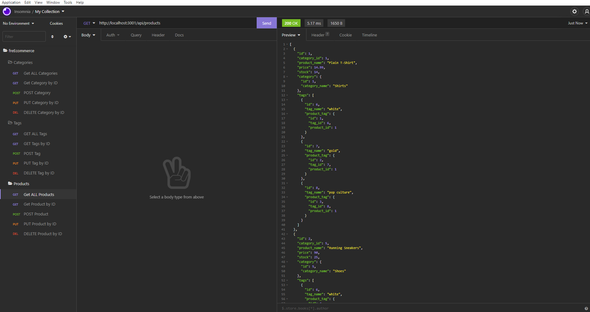

# FreECommerce

## Table-of-Contents

- [Description](#description)

- [Installation](#installation)

- [Usage](#usage)

- [Screenshots](#screenshots)

- [Test Instructions](#test-instructions)

- [Questions](#questions)

- [Contributors](#contributors)

- [Demo](#demo)

- [License](#license)

## Description 
This back end application allows for basic C.R.U.D. operations to be preformed setting up data for use within front-end applications.

## Installation
- Install Insomnia (for managing data)
- Clone repository 
- Run "npm i" dependencies 
- Login to mysql 
- Run "SOURCE db.schema.sql"
- Exit mysql
- Run "npm run seed"
- Run "npm run watch"

# Usage

**[GitHub App Repo Link](https://github.com/brandynh/FreECommerce/)**

## Screenshots
**Get ALL Categories**

---
**Get Categorie by ID**

---
**Get ALL Tags**

---
**Get Tag by ID**

---
**Get ALL Products**

---

 Return to - [**Table of Contents**](#table-of-contents)
---

## Test-Instructions
- Step 1: Make sure you have sourced the sequal schema and seeds
- Step 2: Navigate to the freECommerce root directory
- Step 3: In the terminal run "npm run watch"
- Step 4: Open Insomnia
- Step 5: Manage your data! 

## Questions
- Github: [Click here](https://github.com/brandynh)
- E-mail: [Click here](hufferbrandyn@gmail.com)

    
## Contributors
Brandyn Huffer

## Credits
* [Readme Guide](https://coding-boot-camp.github.io/full-stack/github/professional-readme-guide)
* [Sequalize (Models)](https://sequelize.org/v5/class/lib/model.js~Model.html#static-method-belongsTo)
* [Sqeualize (Associations)](https://sequelize.org/v5/class/lib/associations/base.js~Association.html)
* [Try/Catch](https://developer.mozilla.org/en-US/docs/Web/JavaScript/Reference/Statements/try...catch)

## Demo 

[Click here for a video Demonstration](https://vimeo.com/660788280)

 Return to - [**Table of Contents**](#table-of-contents)
---

## License

